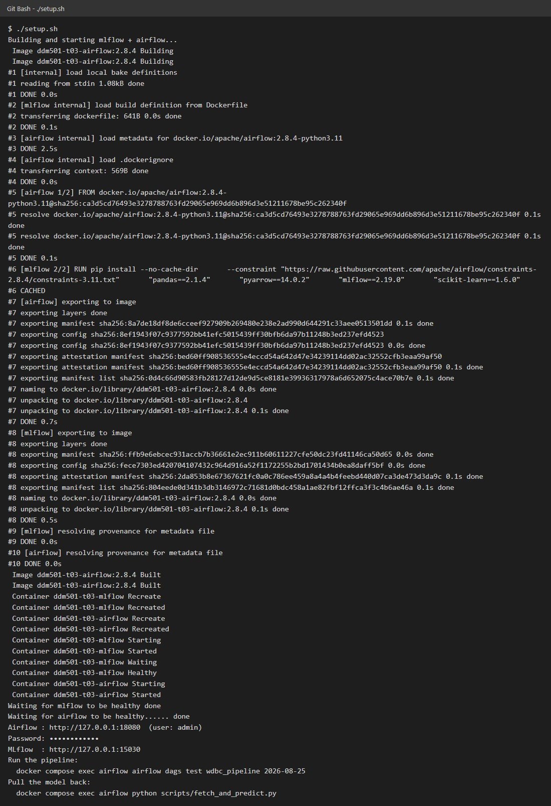
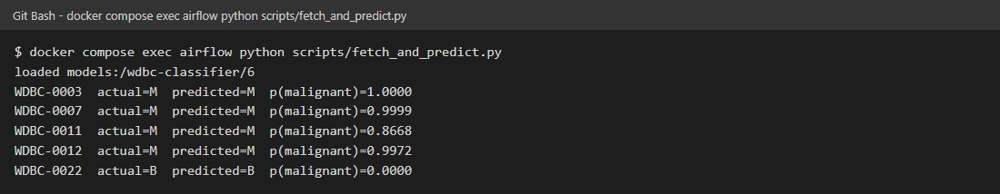

# Automated ML Pipeline với Airflow

**Sinh viên:** Nguyen Van Vu — MSSV vu25ms13298 — DDM501 HN

## Giới thiệu dự án

Đây là một **data pipeline tự động hóa** sử dụng Apache Airflow để xử lý và huấn luyện mô hình machine learning trên dataset WDBC (Wisconsin Breast Cancer). Pipeline tự động chạy theo lịch trình, xử lý dữ liệu từ đầu đến cuối mà không cần can thiệp thủ công.

**Dataset:** WDBC (Breast Cancer) — 570 bản ghi, 30 đặc trưng số, dự đoán chẩn đoán (Malignant/Benign)

## Kiến trúc Pipeline

Pipeline bao gồm **6 tác vụ** được thực thi tự động:

```
ingest → validate → split → scale → train → report
```

| Tác vụ | Mô tả | Output |
|--------|--------|---------|
| **ingest** | Đọc dữ liệu từ `data/raw/wdbc.csv`, snapshot vào parquet | `raw.parquet` |
| **validate** | Kiểm tra chất lượng dữ liệu, loại bỏ dòng lỗi (tối đa 5%) | `clean.parquet`, `rejected.parquet`, `validation_report.json` |
| **split** | Chia train/test theo hash của sample_id (20% test, không random) | `train_unscaled.parquet`, `test_unscaled.parquet` |
| **scale** | Chuẩn hóa đặc trưng bằng z-score | `train.parquet`, `test.parquet`, `scaler.json` |
| **train** | Huấn luyện LogisticRegression, đăng ký model lên MLflow | MLflow run, model version |
| **report** | Ghi kết quả vào lịch sử (`history.jsonl`) | `summary.json`, `history.jsonl` |

## Hệ thống độc lập (Self-contained)

MLflow được **tích hợp sẵn** trong project, không cần dependency bên ngoài:
- Backend: SQLite (`./mlflow-data/mlflow.db`)
- Artifact store: HTTP proxy qua MLflow server
- Config: `docker-compose.yml` tự động setup

Khi chạy qua `docker compose`, tất cả env vars được đặt sẵn. Nếu chạy Airflow local, chỉ cần:

```bash
export MLFLOW_TRACKING_URI=http://127.0.0.1:15030
```

## Cài đặt và Chạy

Có 2 cách chạy pipeline — lựa chọn tùy theo nhu cầu:

### Cách A: Chạy Local (macOS, Linux, Windows + WSL2)

**Yêu cầu:** Python 3.11, pip, terminal bash-compatible

```bash
# Tạo virtual environment
python3.11 -m venv .venv
source .venv/bin/activate  # hoặc .venv\Scripts\activate trên Windows

# Cài dependencies
pip install -r requirements.txt \
  --constraint https://raw.githubusercontent.com/apache/airflow/constraints-2.8.4/constraints-3.11.txt

# Setup Airflow
export AIRFLOW_HOME=$PWD/.airflow
export AIRFLOW__CORE__DAGS_FOLDER=$PWD/dags
export AIRFLOW__CORE__LOAD_EXAMPLES=False
export MLFLOW_TRACKING_URI=http://127.0.0.1:15030

# Khởi chạy
airflow standalone
```

Giao diện Airflow: <http://127.0.0.1:8080>  
Mật khẩu được in ra console lần đầu chạy (hoặc xem `$AIRFLOW_HOME/standalone_admin_password.txt`)

**Ưu điểm:** Nhanh, nhẹ, dễ debug  
**Nhược điểm:** Cần Python 3.11 đúng version, constraint file lớn

### Cách B: Docker Compose (Recommended)

**Yêu cầu:** Docker Desktop, WSL2 (trên Windows)

**Chạy nhanh nhất:**
```bash
./setup.sh
```

Script này sẽ:
1. Build image từ `Dockerfile`
2. Khởi chạy 2 containers: `mlflow` + `airflow`
3. Đợi cả hai healthy (khoảng 1-2 phút)
4. In ra URL và mật khẩu

**Output:**
```
Airflow : http://127.0.0.1:18080  (user: admin)
Password: [mật khẩu ngẫu nhiên]
MLflow  : http://127.0.0.1:15030
```

**Chạy thủ công (nếu không có `./setup.sh`):**
```bash
# Trên Linux, tạo .env với AIRFLOW_UID
echo "AIRFLOW_UID=$(id -u)" > .env

# Build và start containers
docker compose up -d --build

# Kiểm tra trạng thái (chờ STATUS = healthy)
docker compose ps

# Lấy mật khẩu admin
docker compose exec airflow cat /opt/airflow/standalone_admin_password.txt
```

**Lần chạy tiếp theo:**
```bash
docker compose up -d
# hoặc
./setup.sh
```

Docker sẽ reuse image và container, nhanh hơn gấp nhiều lần.

**Port:** 18080 (Airflow), 15030 (MLflow) — tránh xung đột với các dự án khác

**Ưu điểm:** Không phụ thuộc version Python, môi trường sạch, dễ share  
**Nhược điểm:** Cần Docker, khởi chạy lần đầu chậm

## Cấu trúc Dự án

```
.
├── dags/
│   └── wdbc_pipeline.py          # DAG chính (6 tasks)
├── scripts/
│   ├── fetch_and_predict.py      # Tải model và dự đoán
│   └── corrupt_extract.py        # Công cụ test: phá hỏng data để kiểm tra validation
├── data/
│   ├── raw/
│   │   ├── wdbc.csv              # Dataset gốc
│   │   └── wdbc.csv.orig         # Backup (cho corrupt_extract.py --repair)
│   └── staging/                  # Output của mỗi run
│       ├── 2026-08-25/           # Dữ liệu cho một ngày cụ thể
│       │   ├── raw.parquet
│       │   ├── clean.parquet
│       │   ├── rejected.parquet
│       │   ├── train.parquet
│       │   ├── test.parquet
│       │   ├── scaler.json
│       │   ├── summary.json
│       │   └── validation_report.json
│       └── history.jsonl         # Lịch sử tất cả runs (1 dòng/run)
├── docs/screenshots/             # Ảnh chụp kết quả thực tế
├── docker-compose.yml            # Config 2 services: airflow + mlflow
├── Dockerfile                    # Image base: apache/airflow:2.8.4
├── setup.sh                      # Script khởi động nhanh (Docker)
├── requirements.txt              # Python dependencies
└── .gitattributes               # Đảm bảo setup.sh luôn LF
```

## Chạy Pipeline

### Lần đầu tiên

```bash
# Nếu dùng Docker
./setup.sh

# Nếu chạy local, đảm bảo Airflow đã chạy ở background
# Sau đó trong terminal khác:
```

### Chạy DAG cho một ngày cụ thể

```bash
# Nếu dùng Docker
docker compose exec airflow airflow dags test wdbc_pipeline 2026-08-25

# Nếu chạy local (airflow đã standalone)
airflow dags test wdbc_pipeline 2026-08-25
```

Lệnh này sẽ:
1. Chạy toàn bộ 6 tasks tuần tự
2. Tạo thư mục `data/staging/2026-08-25/` chứa output
3. Ghi kết quả vào `data/staging/history.jsonl`
4. Đăng ký model version mới lên MLflow

### Xem kết quả

**Output của một run:**
```
data/staging/2026-08-25/
├── raw.parquet              # Snapshot dữ liệu thô (570 dòng)
├── clean.parquet            # Dữ liệu hợp lệ (564 dòng)
├── rejected.parquet         # Dòng bị loại (6 dòng)
├── validation_report.json   # Chi tiết lỗi validation
├── train.parquet            # Dữ liệu training sau scaling (441 dòng)
├── test.parquet             # Dữ liệu testing sau scaling (123 dòng)
├── scaler.json              # Tham số chuẩn hóa (mean, std)
├── summary.json             # Tóm tắt: metrics, model_version, accuracy, roc_auc
└── validation_report.json
```

**Lịch sử runs:**
```bash
# Xem các runs đã chạy
cat data/staging/history.jsonl

# Kết quả: mỗi dòng là một run, JSON format
{"ds": "2026-08-25", "clean_rows": 564, "accuracy": 0.9512, ...}
```

**MLflow UI:**
- **Airflow:** <http://127.0.0.1:18080> → DAGs → `wdbc_pipeline`
- **MLflow:** <http://127.0.0.1:15030> → Models → `wdbc-classifier` → xem các versions

## Tải và Dự đoán với Model

**Script:** `scripts/fetch_and_predict.py` — tải model từ MLflow registry (không cần Airflow) và dự đoán trên test set.

### Cách nhanh nhất (Docker)

```bash
docker compose exec airflow python scripts/fetch_and_predict.py
```

Output:
```
loaded models:/wdbc-classifier/6
WDBC-0003  actual=M  predicted=M  p(malignant)=1.0000
WDBC-0007  actual=M  predicted=M  p(malignant)=0.9999
...
```

### Chạy trên máy host (không cần Docker)

Chỉ cần: `mlflow`, `scikit-learn`, `pandas`, `pyarrow` (không cần Airflow)

```bash
python3 -m venv .venv-scripts
source .venv-scripts/bin/activate
pip install mlflow==2.19.0 scikit-learn==1.6.0 pandas pyarrow

export MLFLOW_TRACKING_URI=http://127.0.0.1:15030

python scripts/fetch_and_predict.py
```

### Tuỳ chọn

```bash
# Dùng version cụ thể (không phải latest)
python scripts/fetch_and_predict.py --version 3

# Dùng test set của ngày cụ thể
python scripts/fetch_and_predict.py --ds 2026-08-22

# Dự đoán 10 dòng
python scripts/fetch_and_predict.py --rows 10

# Kết hợp
python scripts/fetch_and_predict.py --version 1 --ds 2026-08-22 --rows 5
```

## Bài tập (Exercises)

Những bài tập dưới đây giúp hiểu rõ tính chất của pipeline:

| # | Bài tập | Kỳ vọng | Ghi chú |
|---|---------|---------|---------|
| **1** | Chạy cùng ngày 2 lần:<br>`airflow dags test wdbc_pipeline 2026-08-25`<br>`airflow dags test wdbc_pipeline 2026-08-25` | 7 file output giống hệt nhau (check `sha256sum`)<br>`history.jsonl` vẫn 1 dòng cho ngày đó<br>→ Re-run là idempotent | Cho thấy pipeline có quy tắc rõ ràng, không random. Split dùng hash(sample_id), không random seed. |
| **2** | Làm hỏng data:<br>`python scripts/corrupt_extract.py`<br>Rồi chạy lại:<br>`airflow dags test wdbc_pipeline 2026-08-25`<br>Sửa lại:<br>`python scripts/corrupt_extract.py --repair` | Task `validate` fail ngay (không retry 3 lần)<br>Log: `13.0% of rows rejected, limit is 5%`<br>và `Immediate failure requested`<br>→ AirflowFailException tắt retry | Cho thấy Airflow có cơ chế fail-fast cho lỗi logic. Khác với timeout/error — nếu data hỏng, retry vô ích. |
| **3** | Chạy backfill nhiều ngày:<br>`airflow dags backfill wdbc_pipeline -s 2026-08-22 -e 2026-08-24` | 3 thư mục mới:<br>`data/staging/2026-08-22/`<br>`data/staging/2026-08-23/`<br>`data/staging/2026-08-24/`<br>`history.jsonl` có 4 dòng (kèm 25) | Airflow xử lý batch theo ngày tự động. Mỗi ngày là một execution_date riêng biệt, output tách nhau. |
| **4** | Làm task fail (ví dụ: corrupt data ở bài 2), mở Airflow UI:<br>Grid view → click task `validate` → Logs | Xem traceback chi tiết không cần SSH<br>Hiển thị dòng code lỗi, exception đầy đủ | Airflow UI giúp debug mà không cần truy cập container trực tiếp. |
| **5** | Chạy lại ngày đó rồi vào MLflow UI<br>`airflow dags test wdbc_pipeline 2026-08-25`<br>→ <http://127.0.0.1:15030> Models → `wdbc-classifier` | Version mới được tạo<br>v1 → v2 → ... → v_n<br>Mỗi run tạo 1 version, kể cả re-run cùng ngày | MLflow tự track version, không cần quản lý thủ công. Giúp so sánh model qua thời gian. |
| **6** | Load model từ registry:<br>`python scripts/fetch_and_predict.py`<br>hoặc trong Docker:<br>`docker compose exec airflow python scripts/fetch_and_predict.py` | Dự đoán đúng trên test set<br>Không cần Airflow chạy<br>Chỉ cần MLflow server + model code | Tách riêng inference từ training pipeline. Model được version hóa, tái sử dụng dễ dàng. |

### Các lệnh hữu ích

```bash
# Xem DAG graph
airflow dags list-runs wdbc_pipeline

# Xem logs của task cụ thể
docker compose exec airflow airflow tasks log wdbc_pipeline ingest 2026-08-25

# Clear dữ liệu một ngày (reset để chạy lại)
rm -rf data/staging/2026-08-25/

# Dừng containers
docker compose down

# Xem model versions
docker compose exec airflow python -c "
import mlflow
mlflow.set_tracking_uri('http://127.0.0.1:15030')
model = mlflow.MlflowClient().get_registered_model('wdbc-classifier')
for v in model.latest_versions:
    print(f'Version {v.version}: {v.current_stage}')
"
```

## Troubleshooting

### Docker/WSL Issues

| Vấn đề | Nguyên nhân | Giải pháp |
|--------|-----------|---------|
| `Docker Desktop is unable to start` | WSL kernel cũ | Chạy `wsl --update` trong PowerShell (admin), rồi mở lại Docker Desktop |
| `docker: command not found` | Docker chưa có trong PATH | Thêm Docker path vào PATH hoặc restart terminal sau khi cài Docker Desktop |
| Container không healthy sau 2 phút | Image chưa pull xong | Chạy `docker compose logs airflow` để xem chi tiết; đợi thêm hoặc check network |
| `Permission denied` khi copy file (Windows) | Windows bind mount không hỗ trợ `chmod` | Dùng `shutil.copyfile` thay vì `shutil.copy` (đã sửa trong repo) |

### Airflow Issues

| Vấn đề | Nguyên nhân | Giải pháp |
|--------|-----------|---------|
| `No module named airflow` | Virtual environment chưa activate | Chạy `source .venv/bin/activate` (Linux/Mac) hoặc `.venv\Scripts\activate` (Windows) |
| DAG không hiển thị | `AIRFLOW__CORE__DAGS_FOLDER` sai | Kiểm tra: `echo $AIRFLOW__CORE__DAGS_FOLDER` phải là đường dẫn đầy đủ |
| Task timeout | Data quá lớn hoặc máy chậm | Tăng `execution_timeout` trong DAG hoặc giảm batch size |
| `MLFLOW_TRACKING_URI` không set | Biến môi trường bị xóa | Chạy `export MLFLOW_TRACKING_URI=http://127.0.0.1:15030` lại |

### MLflow Issues

| Vấn đề | Nguyên nhân | Giải pháp |
|--------|-----------|---------|
| MLflow server không chạy | Process bị kill | Restart: `docker compose restart mlflow` hoặc `./setup.sh` |
| Model không load từ registry | Version không tồn tại | Chạy DAG trước để tạo version: `airflow dags test wdbc_pipeline 2026-08-25` |
| Artifact upload lỗi | Đường dẫn artifact store sai | Dùng `--artifacts-destination file:///path` (không phải `C:\path` trên Windows) |

## Kết quả đã chạy thử (end-to-end)

Chạy ngày 2026-09-20 trên Windows 11 + Docker Desktop 4.91 (WSL 2.7.14),
lệnh chạy từ Git Bash. Toàn bộ số liệu dưới đây lấy từ chính lần chạy này.

**Dựng stack.** `./setup.sh` lần đầu (tải image `apache/airflow:2.8.4`, build,
đợi `mlflow` rồi `airflow` healthy) mất 5 phút 18 giây. Cả hai container
`ddm501-t03-mlflow` và `ddm501-t03-airflow` đều `healthy`.

**Pipeline** — `docker compose exec airflow airflow dags test wdbc_pipeline 2026-08-25`:
cả 6 task (`ingest → validate → split → scale → train → report`) SUCCESS.
Extract 570 dòng, `validate` loại 6 dòng (1,05%: null 2, negative 1, bad_label 1,
duplicate 1, outlier 1) → 564 dòng sạch, chia 441 train / 123 test. `train` đăng
ký `wdbc-classifier` lên MLflow của chính project này: `accuracy=0.9512`,
`roc_auc=0.9956`.

| Bài | Kết quả thực tế |
|---|---|
| 1. Chạy lại cùng ngày | 7 file (`raw`, `clean`, `rejected`, `train`, `test` parquet, `scaler.json`, `validation_report.json`) giống hệt nhau theo `sha256`; `history.jsonl` vẫn 1 dòng cho `2026-08-25`. |
| 2. Dữ liệu hỏng | `corrupt_extract.py` làm trống `mean_radius` ở 68/570 dòng (11,9%). `validate` fail với `13.0% of rows rejected, limit is 5%` và log ghi `Immediate failure requested` — không retry. `--repair` khôi phục `wdbc.csv` (hash trùng bản trong git). |
| 3. Backfill | `airflow dags backfill ... -s 2026-08-22 -e 2026-08-24`: 3 run, 18 task thành công, 0 lỗi; xuất hiện 3 thư mục ngày mới, `history.jsonl` có 4 dòng (kèm `2026-08-25`). |
| 5. Version mới mỗi lần chạy | Mỗi lần `train` chạy đều tạo một version mới, kể cả chạy lại cùng ngày: registry có 6 version (v1–v6) sau các lần chạy trên. |
| 6. Kéo model về | `fetch_and_predict.py` tải `models:/wdbc-classifier/6`, dự đoán đúng 5/5 dòng test; `--version 1 --ds 2026-08-22 --rows 3` cũng đúng 3/3. |

Bài 4 (đọc log của task hỏng trong Grid view) chưa được chụp lại; traceback của
`validate` xem được qua log của lệnh ở bài 2.

**Hai lỗi chỉ xuất hiện khi chạy trên Windows, đã sửa trong repo:**

- `setup.sh`: Git Bash tự đổi `/opt/airflow/...` thành `C:/Program Files/Git/opt/airflow/...`
  nên dòng `Password:` bị trống. Sửa bằng `MSYS_NO_PATHCONV=1` (không ảnh hưởng Linux/macOS).
- `scripts/corrupt_extract.py --repair`: `shutil.copy` chép nội dung xong rồi `chmod`,
  bị `PermissionError` trên ổ bind-mount của Windows. Đổi sang `shutil.copyfile`.

Trên Windows, Docker Desktop cần WSL mới: nếu Docker báo `WSL update required`, chạy
`wsl --update` trong PowerShell quyền admin rồi mở lại Docker Desktop.

**Ghi chú thiết kế.** `mlflow` dùng `--artifacts-destination` (giữ artifact root mặc
định `mlflow-artifacts:/`) thay vì một đường dẫn local làm `--default-artifact-root`.
Nếu dùng đường dẫn local, client (container `airflow`, có filesystem khác container
`mlflow`) sẽ cố ghi thẳng vào đường dẫn đó và bị `PermissionError`; với
`--artifacts-destination`, mọi đọc/ghi artifact đi qua HTTP API của MLflow server.

### Ảnh chụp màn hình

Bốn ảnh giao diện chụp trực tiếp bằng Edge headless từ Airflow (`:18080`) và MLflow
(`:15030`) đang chạy. Hai ảnh terminal được dựng lại từ output thật đã ghi log
(`setup.sh` là lần chạy thứ hai, image đã có cache; password đã được che).

| | |
|---|---|
| `./setup.sh` — build, đợi `mlflow` rồi `airflow` healthy, in URL/password |  |
| Airflow — Grid view: 4 run của `wdbc_pipeline`, cả 6 task đều SUCCESS |  |
| Airflow — Graph view: `ingest → validate → split → scale → train → report` |  |
| MLflow — 6 version của `wdbc-classifier` đã đăng ký |  |
| MLflow — chi tiết run `wdbc-2026-08-25`: `accuracy=0.9512`, `roc_auc=0.9956`, đăng ký `wdbc-classifier v6` |  |
| `scripts/fetch_and_predict.py` — tải `wdbc-classifier` v6, dự đoán đúng 5/5 dòng test |  |
