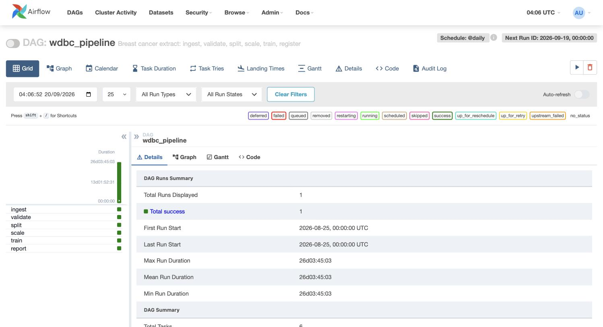
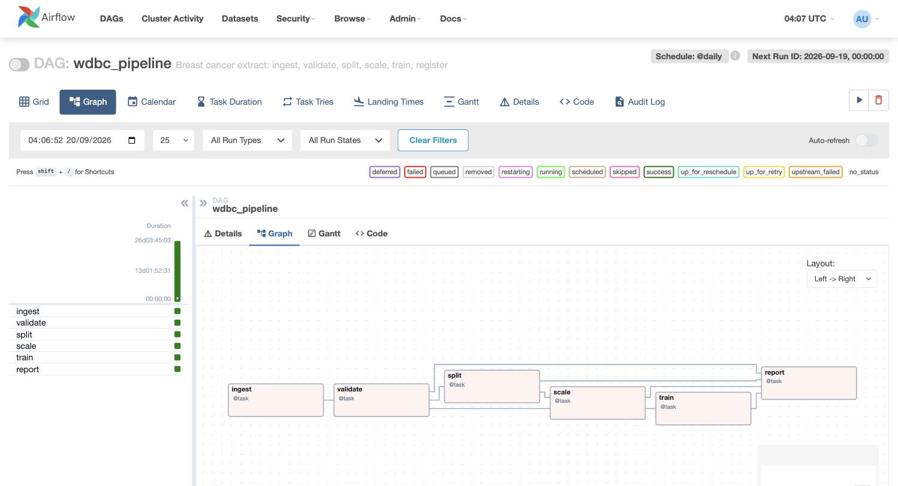
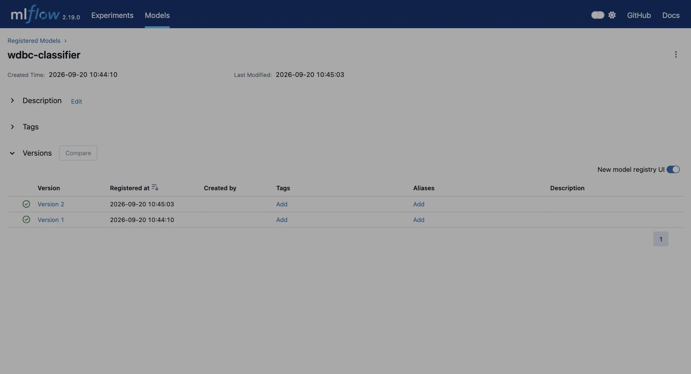
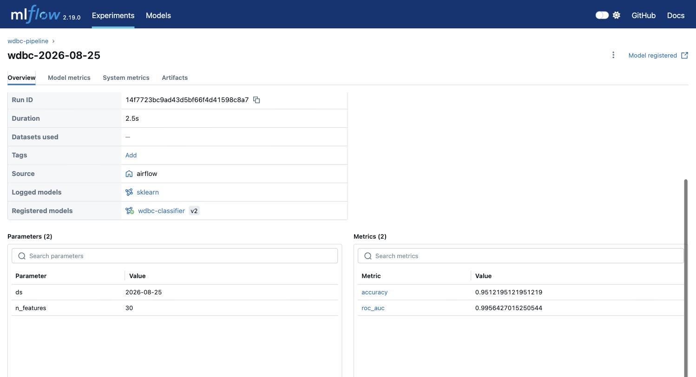

# Tutorial 03 — Airflow: a pipeline that runs without you

**Học viên:** Lộc Nguyễn Phúc — MSSV MS13314 — DDM501 HN

## What this tutorial is for

The pipeline: ingest, validate, split, scale, train, register. The last two
steps hand the trained model to MLflow so it can be pulled back later without
Airflow in the picture.

## MLflow: start it first

The `train` task registers into Tutorial 02-02's MLflow server. Start that
stack before running this DAG:

```bash
cd ../ddm501-t02-02-full-stack   # or wherever that tutorial lives
docker compose up -d
```

Running this DAG locally (not via `docker compose`) also needs these env vars
exported in the same shell -- they're the credentials for that stack's MinIO,
already set in `.env` there:

```bash
export MLFLOW_TRACKING_URI=http://127.0.0.1:15020
export MLFLOW_S3_ENDPOINT_URL=http://127.0.0.1:19010
export AWS_ACCESS_KEY_ID=minio
export AWS_SECRET_ACCESS_KEY=minio123
export AWS_DEFAULT_REGION=us-east-1
```

Running via `docker compose` needs none of this -- `docker-compose.yml`
already sets it, reaching the other stack's published ports through
`host.docker.internal`.

## Two ways to run it

Both give the same DAG.

**A. Locally** (macOS, Linux, Windows + WSL2) — lighter, faster:

```bash
python3.11 -m venv .venv
source .venv/bin/activate
pip install -r requirements.txt \
  --constraint https://raw.githubusercontent.com/apache/airflow/constraints-2.8.4/constraints-3.11.txt

export AIRFLOW_HOME=$PWD/.airflow
export AIRFLOW__CORE__DAGS_FOLDER=$PWD/dags
export AIRFLOW__CORE__LOAD_EXAMPLES=False
airflow standalone
```

The web UI comes up on <http://127.0.0.1:8080>. `standalone` prints the admin password on first start and also writes it to
`$AIRFLOW_HOME/standalone_admin_password.txt`.

**B. Docker** — one container, built once from the `Dockerfile` beside this file:

```bash
# On Linux only
echo "AIRFLOW_UID=$(id -u)" > .env

docker compose up -d --build
docker compose ps        # wait for STATUS = healthy, about a minute
docker compose exec airflow cat /opt/airflow/standalone_admin_password.txt
```

After the first time, `docker compose up -d` is enough — Docker reuses the
image it already built. Add `--build` again only when you change the
`Dockerfile`.

<http://127.0.0.1:18080>, user `admin`. Port 18080 and not 8080, because Lab 2
owns 8080 and you will want both running one day.

## Running the pipeline

This runs every task in order, in your terminal:

```bash
airflow dags test wdbc_pipeline 2026-08-25
```

Then look at what it produced:

```
data/staging/2026-08-25/
  raw.parquet              snapshot of the extract, frozen for this run
  clean.parquet            rows that passed validation
  rejected.parquet         rows that did not, kept for inspection
  validation_report.json   what failed and how often
  train.parquet  test.parquet  scaler.json
  summary.json               now also has mlflow_run_id, model_version, accuracy, roc_auc
data/staging/history.jsonl one line per run
```

Check the registered model in the MLflow UI at <http://127.0.0.1:15020>,
experiment `wdbc-pipeline`, registered model `wdbc-classifier`.

## Pulling the model back

`scripts/fetch_and_predict.py` loads the registered model through MLflow's
client API (not Airflow, not a copied file) and scores a few test rows.

Easiest: run it inside the Airflow container, which already has the
dependencies and the env vars set:

```bash
docker compose exec airflow python scripts/fetch_and_predict.py
```

Running it on the host instead needs its own environment -- this script only
needs `mlflow`/`scikit-learn`/`pandas`/`pyarrow`, not Airflow itself, so a
plain venv is enough (no python3.11 or constraints file required):

```bash
python3 -m venv .venv-scripts
source .venv-scripts/bin/activate
pip install mlflow==2.19.0 scikit-learn==1.6.0 pandas pyarrow boto3

export MLFLOW_TRACKING_URI=http://127.0.0.1:15020
export MLFLOW_S3_ENDPOINT_URL=http://127.0.0.1:19010
export AWS_ACCESS_KEY_ID=minio
export AWS_SECRET_ACCESS_KEY=minio123
export AWS_DEFAULT_REGION=us-east-1

python scripts/fetch_and_predict.py
```

Pass `--version N` to pull a specific model version instead of the latest, or
`--ds YYYY-MM-DD` to score a specific run's test set.

## The exercises

| | Do this | Look for |
|---|---|---|
| 1 | `airflow dags test wdbc_pipeline 2026-08-25` twice | The outputs are byte-identical and `history.jsonl` still has one line for that date. Re-running a date is safe. |
| 2 | `python scripts/corrupt_extract.py` then re-run | `validate` fails with `13.0% of rows rejected, limit is 5%`, and the log says **Immediate failure requested** — the three retries were skipped on purpose. Repair with `--repair`. |
| 3 | `airflow dags backfill wdbc_pipeline -s 2026-08-22 -e 2026-08-24` | Three run folders appear, one per date, three lines in `history.jsonl`. |
| 4 | Open the UI, Grid view, click a failed task, then Logs | The traceback for one task of one date, without SSH-ing anywhere. |
| 5 | `airflow dags test wdbc_pipeline 2026-08-25` again, then check the MLflow UI | A new run under experiment `wdbc-pipeline` and a new version of `wdbc-classifier` — each Airflow run registers its own model version, even on a re-run of the same date. |
| 6 | `python scripts/fetch_and_predict.py` | Predictions for a few test rows, loaded straight from the registry — no Airflow process involved. |

## Kết quả đã chạy thử (end-to-end)

Đã build + chạy toàn bộ pipeline trong Docker (`docker compose up -d --build`),
với MLflow server của Tutorial 02-02 chạy song song:

- `airflow dags test wdbc_pipeline 2026-08-25` — cả 6 task
  (`ingest → validate → split → scale → train → report`) đều SUCCESS.
- Task `train` đăng ký thành công model `wdbc-classifier` lên MLflow
  registry: **version 1**, `accuracy=0.9512`, `roc_auc=0.9956`.
- Chạy lại cùng ngày `2026-08-25` → tạo **version 2** mới (không ghi đè
  version cũ), đúng hành vi kỳ vọng: mỗi lần train là một run/version mới.
- `scripts/fetch_and_predict.py` (cả trong container lẫn qua venv host
  `.venv-scripts`) tải model về qua MLflow client API và dự đoán đúng
  5/5 dòng test so với nhãn thật (`diagnosis`).

### Ảnh chụp màn hình

| | |
|---|---|
| Airflow — DAG `wdbc_pipeline`, cả 6 task SUCCESS (container `ddm501-t03-airflow` đang chạy) |  |
| Airflow — Graph view, `train` nối sau `scale`, trước `report` |  |
| MLflow — 2 version của `wdbc-classifier` đã đăng ký |  |
| MLflow — chi tiết run: `accuracy=0.9512`, `roc_auc=0.9956`, nguồn `airflow`, đã register `wdbc-classifier v2` |  |

Một vấn đề gặp phải và đã sửa: pin `boto3==1.35.90` ban đầu xung đột với
constraint file của Airflow 2.8.4 (đã pin sẵn `boto3==1.33.13` cho amazon
provider) — bỏ pin cứng, để `boto3` cài theo constraint file là chạy được.